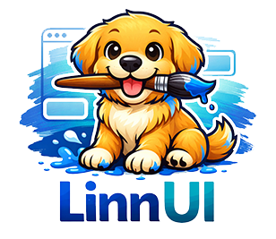

# LinnUI

**LinnUI** is a concise, declarative Go UI library built on
[Gio](https://gioui.org). It provides polished defaults, reactive state, and
familiar components without introducing HTML, CSS, or JavaScript.

## Features

- **Small declarative API:** compose functions such as `Scaffold`, `Column`,
  `Card`, and `Text`.
- **Reactive state:** typed `State[T]` values invalidate one or more windows
  automatically.
- **Quality defaults:** semantic light/dark themes, accessible labels,
  keyboard-ready Gio controls, disabled states, and 48dp interaction targets.
- **Practical components:** buttons, text fields, checkboxes, switches, radio
  groups, sliders, cards, app bars, dialogs, snackbars, scrolling, and images.
- **Predictable state:** one `Tree` owns interaction state per window; scopes
  prevent ID collisions and can be reset when a screen closes.
- **Cross-platform foundation:** Gio targets desktop, mobile, and WebAssembly
  from the same Go UI code.

## Try the gallery

```bash
go run ./examples/gallery
```

The gallery demonstrates themes, typography, forms, cards, overlays, floating
actions, and runtime state updates.

## Theming

LinnUI provides light and dark themes with semantic colors for primary actions,
containers, backgrounds, surfaces, text, errors, outlines, shadows, and disabled
states. The defaults follow [shadcn Neutral](https://ui.shadcn.com/docs/theming)
(near-black primary actions, zinc-like surfaces). Core components consume these
roles automatically.

```go
th := ui.Light
if darkMode.Get() {
	th = ui.Dark
}

ui.Scaffold(
	ui.TopBar(ui.AppBar("My app")),
	ui.Body(ui.Container(
		ui.Text("Theme-aware content"),
		ui.SurfaceBackground(),
		ui.OutlineBorder(1),
	)),
)(gtx, &th)
```

See `examples/theme` for a focused runtime theme-switching sample.

## Quick Example

```go
package main

import (
	"log"
	"os"
	"strconv"

	"gioui.org/app"
	"gioui.org/op"

	ui "github.com/markschellhas/linnui/ui"
)

func main() {
	go func() {
		w := new(app.Window)
		tree := ui.NewTree(w)
		defer tree.Close()
		count := ui.NewState(0).Bind(w)
		if err := run(w, tree, count); err != nil {
			log.Print(err)
		}
		os.Exit(0)
	}()
	app.Main()
}

func run(w *app.Window, tree *ui.Tree, count *ui.State[int]) error {
	var ops op.Ops
	theme := ui.Light

	for {
		switch event := w.Event().(type) {
		case app.DestroyEvent:
			return event.Err
		case app.FrameEvent:
			gtx := app.NewContext(&ops, event)
			ui.Center(ui.Column([]any{
				ui.Text("Count: "+strconv.Itoa(count.Get()), ui.Style(ui.H4)),
				tree.Button("Increment",
					ui.ButtonID("increment"),
					ui.OnClick(func() { count.Update(func(n int) int { return n + 1 }) }),
				),
			}, ui.Spacing(16)))(gtx, &theme)
			event.Frame(gtx.Ops)
		}
	}
}
```

See `examples/state` for text binding and additional state patterns.

## State and forms

Create one `Tree` per window and use its constructors for interactive widgets.
The package-level constructors remain available for small examples, while a
Tree guarantees isolation across windows and screens.

```go
form := tree.Scope("profile")
name := ui.NewState("").Bind(window)

field := form.TextField(
	ui.TextFieldID("name"),
	ui.Hint("Name"),
	ui.BindText(name),
)
```

Call `form.Close()` when a temporary screen is permanently removed, or
`form.Reset()` to discard its saved interaction state.

## Requirements

- **Go 1.26+** (see `go.mod`)
- Linux desktop builds need Gio system libraries. On Debian/Ubuntu:

```bash
sudo apt-get update
sudo apt-get install -y \
  libegl1-mesa-dev \
  libvulkan-dev \
  libwayland-dev \
  libx11-dev \
  libx11-xcb-dev \
  libxkbcommon-dev \
  libxkbcommon-x11-dev \
  libxcursor-dev \
  libxfixes-dev
```

## Installation

```bash
go get github.com/markschellhas/linnui/ui
```

## Why LinnUI?

LinnUI fills the space between Gio's low-level primitives and browser-based
desktop stacks. It intentionally favors a small, readable API over a large
framework.

## Accessibility

LinnUI uses Gio's native semantic classes and focus behavior for buttons,
editors, checkboxes, switches, and radio controls. Disabled components suppress
input rather than only changing color. Gio v0.10 does not expose dialog,
heading, live-region, or adjustable-range semantic roles, so dialogs,
snackbars, and sliders use the best available labels and keyboard behavior
without claiming unsupported screen-reader capabilities.

## Status

Early development (v0.4.0) — API subject to change. Contributions welcome!

See [CHANGELOG.md](CHANGELOG.md) for release history.

---

Copyright (c) 2025-2026 Mark Schellhas. All Rights Reserved.
